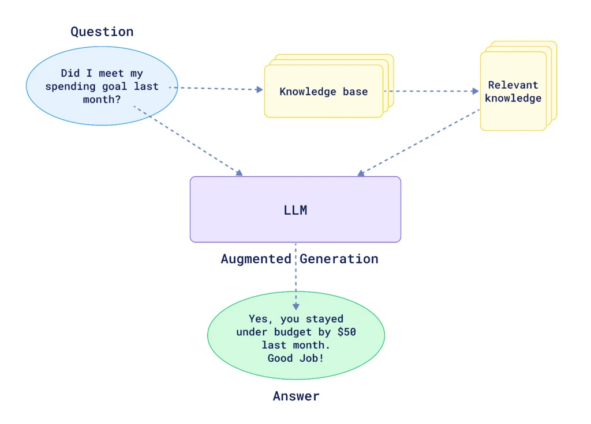

## Project Overview

A Retrieval-Augmented Generation (RAG) chatbot that answers Indonesian criminal law questions by retrieving relevant statutes from a corpus of 5,474 legal documents and generating answers grounded exclusively in those retrieved texts.

## Goals

- Creating an **accurate** model for legal chatbot
- Creating chatbot with source of truth that are **flexible**, **up-to-date** and **comprehensive** based on real statutory regulation.

## How it works

This project follows basic RAG schema that was first introduced back in 2023. The main focus of this project is to test the effectiveness of the method itself to process legal text, thus, not much pre or post-processing steps added to the process the data.

## Timeline

- **Started:** January 2025 - December 2025
- **Status:** Completed

## Links

- **Code repository:** [GitHub](https://github.com/ShoAnn/indo-legal)
- **Dataset repository:** [HuggingFace](https://huggingface.co/ShoAnn/datasets)
